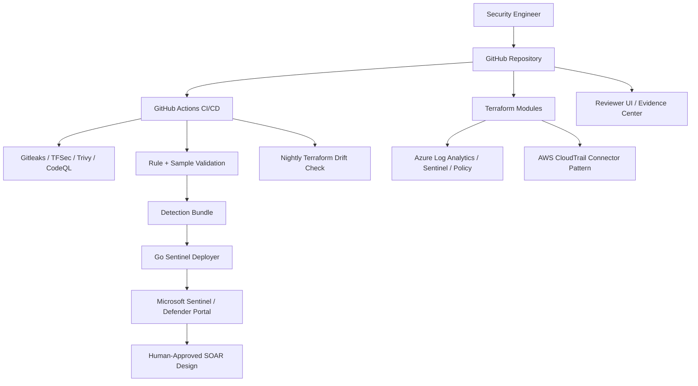

# Microsoft Sentinel Cloud Security Detection Engineering Lab

[](https://github.com/jasonachkar/microsoft-sentinel-siem-detection/actions/workflows/sentinel-ci-cd.yaml)
[](https://github.com/jasonachkar/microsoft-sentinel-siem-detection/actions/workflows/drift-detection.yaml)

Microsoft Sentinel Cloud Security Detection Engineering Lab showing Detection-as-Code, KQL analytics rules, Terraform-managed SIEM infrastructure, CI/CD security gates, drift detection, and SOAR response design.

## Live Demo

Live demo: https://sentinel-detection-pack.vercel.app

The UI is a reviewer experience for a private lab. Demo telemetry is labelled, optional API-backed pages can be empty without being broken, and proof paths point back to repository files.

## 60-Second Overview

This repository demonstrates how a cloud security engineer can organize Microsoft Sentinel detections, Terraform security infrastructure, CI validation, drift detection, and evidence into a defensible portfolio lab. It is built to be reviewed quickly through the UI and then inspected in code.

## What This Proves

- Microsoft Sentinel Detection-as-Code using YAML and KQL.
- KQL analytics rule engineering with MITRE ATT&CK metadata, entity mappings, custom details, and tuning notes.
- Terraform-managed Sentinel, Azure Policy, SOAR, honeypot, and AWS CloudTrail connector patterns.
- CI/CD security gates for secrets, IaC, dependencies, Go code, UI build, and detection metadata/sample validation.
- Drift detection workflow using scheduled Terraform plan checks.
- Human-approved SOAR containment design with least-privilege intent.
- Evidence-first UI design that separates real code, demo telemetry, planned work, and limitations.
- Defender portal-aware Sentinel workflow positioning.

## Reviewer Mode Screenshot

Screenshot evidence is intentionally not faked. Capture a sanitized Reviewer Mode screenshot and place it under `evidence/github/` or `evidence/azure/` following `evidence/README.md`.

## Architecture Diagram



## Real vs Simulated

| Area | Status | Notes |
| --- | --- | --- |
| Sentinel IaC | Real Terraform | Deployable with an Azure subscription and appropriate variables/secrets. |
| KQL/YAML rules | Real files | Located under `sentinel-detection-pack/rules/` and `sentinel-detection-pack/rules-yaml/`. |
| Go deployer | Real dry-run/apply path | Uses `DefaultAzureCredential`; deploys scheduled analytics rule definitions where configured. |
| CI/CD security gates | Real GitHub Actions workflow | Runs scans and validation in `.github/workflows/sentinel-ci-cd.yaml`. |
| Drift detection workflow | Real workflow | Requires Azure OIDC and remote state secrets to run against an environment. |
| UI incident/telemetry data | Demo/simulated unless labelled otherwise | Used to demonstrate reviewer flow without requiring a paid always-on lab. |
| Detection assertion | Metadata/sample validation locally; optional live script separately | Local validation does not execute KQL or prove a Sentinel alert fired. |
| SOAR response | Terraform shell/design unless connected and tested live | Treat as a human-approved containment design until run history evidence is captured. |
| Threat intelligence UI | Demo/API-dependent | Public feeds may fail due to browser/CORS limits and fall back to demo data. |

## Key Features

- Reviewer Mode for a 5-minute senior-engineer review path.
- Evidence Center for proof paths, missing screenshot placeholders, and real-vs-demo inventory.
- Interview Mode with skill matrix, hard questions, safe resume bullets, and non-claims.
- Flagship Entra ID password spray walkthrough.
- PrimeReact UI for detection rules, cloud controls, drift, SOAR design, and demo workflows.
- Detection metadata/sample validation runner.
- Optional live Sentinel validation script for configured Azure environments.

## Repository Layout

| Path | Purpose |
| --- | --- |
| `.github/workflows/` | CI/CD and drift detection workflows. |
| `src-cli/` | Go-based Sentinel rule deployer and validation logic. |
| `sentinel-detection-pack/rules-yaml/` | Sentinel analytics rule definitions. |
| `sentinel-detection-pack/rules/` | KQL source files with rule metadata. |
| `sentinel-detection-pack/sample-data/` | JSONL sample telemetry for local validation. |
| `sentinel-detection-pack/ui/` | React + PrimeReact reviewer UI. |
| `terraform/` | Sentinel core infrastructure. |
| `terraform-policy/` | Azure Policy examples for cloud security guardrails. |
| `terraform-soar/` | Logic App SOAR shell and human-approved workflow design. |
| `terraform-aws-connector/` | AWS CloudTrail connector pattern with S3/KMS/IAM trust. |
| `docs/detection-engineering/` | Rule quality standard, tuning, false positives, and coverage matrix. |
| `docs/adr/` | Architecture Decision Records and tradeoffs. |
| `evidence/` | Sanitized screenshot/artifact collection structure. |
| `scripts/` | Validation, test, optional live verification, ChatOps, and demo scripts. |

## Detection-as-Code

Rules are modeled as YAML/KQL so metadata can be reviewed and validated. The Go deployer supports dry-run explain output and validation reporting for rule fields such as severity, query period/frequency, MITRE mapping, entity mappings, custom details, alert details, incident configuration, and connector requirements.

Important files:

- `src-cli/deployer.go`
- `src-cli/deployer_test.go`
- `src-cli/README.md`
- `scripts/test-detections.py`
- `docs/detection-engineering/rule-quality-standard.md`

## Cloud Security Infrastructure

Terraform modules show how the lab would be deployed and governed:

- Sentinel core and Log Analytics workspace pattern in `terraform/`.
- Azure Policy guardrails in `terraform-policy/`.
- Human-approved SOAR design in `terraform-soar/`.
- AWS CloudTrail ingestion pattern in `terraform-aws-connector/`.
- Temporary honeypot lab infrastructure in `terraform-honeypot/`.

## CI/CD and Drift Detection

`.github/workflows/sentinel-ci-cd.yaml` validates security scans, Go code, UI build, Terraform modules, and detection metadata/sample coverage. `.github/workflows/drift-detection.yaml` documents the scheduled Terraform drift check and issue creation pattern.

## SOAR

The SOAR content is intentionally labelled as a human-approved containment design. It shows how a Logic App could parse a Sentinel incident, check approved scope, request approval, apply scoped action only after approval, notify the SOC channel, and write the result back to the incident.

Docs:

- `docs/soar/human-approved-containment.md`
- `docs/soar/least-privilege-identity.md`
- `docs/soar/failure-modes.md`

## UI Reviewer Experience

Prioritize these routes:

- `/reviewer` - guided senior-engineer review path.
- `/evidence` - proof inventory and missing evidence placeholders.
- `/interview` - skill matrix and interview preparation.
- `/scenario/password-spray` - flagship detection walkthrough.
- `/cloud-security-controls` - cloud security posture story.
- `/decisions` - ADR summaries.

Secondary demo pages are labelled as demo or concept views.

## Evidence Folder

The `evidence/` folder defines where sanitized proof artifacts should be stored. Do not commit sensitive tenant data. Follow `evidence/README.md` for what to blur and what each screenshot proves.

## Local Development

```bash
cd sentinel-detection-pack/ui
npm install
npm run dev
```

Run local detection metadata/sample validation:

```bash
python scripts/test-detections.py
```

Run the Go deployer tests:

```bash
cd src-cli
go test ./...
```

## Deployment

Live deployment is optional and requires cloud credentials, workspace IDs, tenant-specific variables, and safe lab resources. Use dry-run validation first:

```bash
cd src-cli
go run . -rules ../sentinel-detection-pack/rules-yaml -dry-run -explain
```

## Known Limitations

- The UI uses demo telemetry unless a page clearly says an API is configured.
- Local detection validation checks metadata and sample data; it does not execute KQL.
- Optional live Sentinel validation requires Azure credentials and a configured workspace.
- SOAR containment is documented as human-approved design until live run history is captured.
- Evidence screenshots are placeholders until sanitized artifacts are added.
- This is not a SOC 2, ISO 27001, or NIST certification package.

## Interview Talking Points

- Why scheduled Sentinel rules were chosen before NRT rules.
- How entity mappings and custom details improve investigation quality.
- How password spray thresholds are tuned and why allowlists matter.
- How GitHub OIDC reduces CI/CD secret risk.
- How Terraform drift becomes a security signal.
- What would be required to convert local validation into live Sentinel assertion.
- How to control Sentinel ingestion costs in a lab.

## Roadmap

- Add sanitized screenshots to `evidence/`.
- Parse GitHub Actions artifacts/SARIF into the UI instead of using demo AppSec rows.
- Add optional live Sentinel validation to CI for a dedicated lab workspace.
- Add ASIM variants for selected detections.
- Add Defender portal screenshots and mapping evidence.
- Add a small release checklist for safe live-lab teardown.

## Safe Positioning

Safe claim: "I built a Microsoft Sentinel cloud security detection engineering lab with repo-backed KQL rules, Terraform modules, CI/CD validation, drift detection, SOAR design, and a UI that clearly separates real code from demo telemetry."

Do not claim: production SOC, enterprise MDR platform, autonomous containment, compliance certification, or fully live telemetry.
