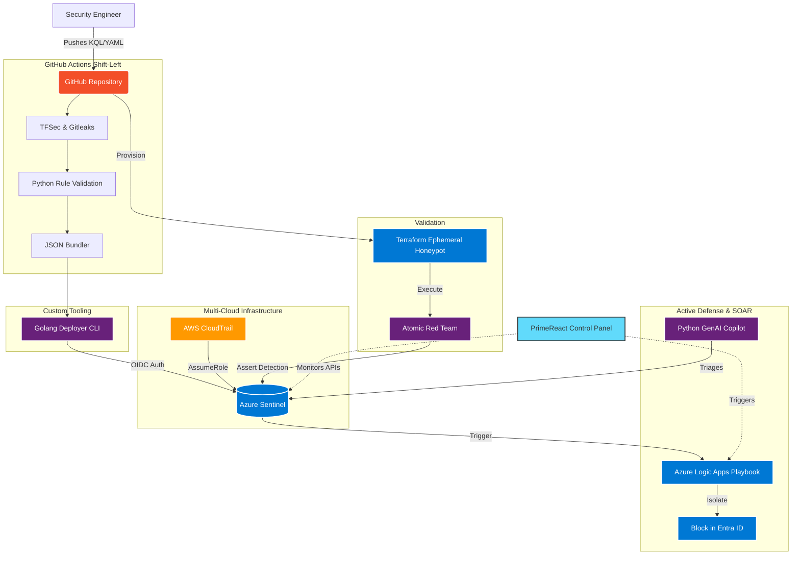

# 🛡️ Sentinel Detection Pack

## Enterprise Architecture

This repository represents a complete, automated DevSecOps and Active Defense pipeline.



> **Interactive Cloud Security Operations Platform**  
> Production-ready Microsoft Sentinel analytics rules with live threat intelligence, attack simulations, and MITRE ATT&CK coverage.

[](https://sentinel-detection-pack.vercel.app)
[](LICENSE)
[](https://attack.mitre.org/)


## ✨ Features

### ⚡ Enhanced Attack Simulator (NEW!)
Run realistic attack scenarios with **live script visualization**:
- **12 Attack Scenarios** - Password spray, MFA fatigue, LSASS dump, and more
- **🔴 Live Script Execution** - Watch PowerShell, Python, and Bash scripts run in real-time
- **Terminal-Style Output** - See exact commands and their output as attacks progress
- **IOC Extraction** - Automatic extraction of IPs, hashes, and techniques with copy buttons
- **Remediation Steps** - Actionable response guidance for each attack phase

### 🗺️ Global Threat Map with LIVE DATA
Real-time visualization using **real threat intelligence APIs**:
- **FeodoTracker C2 Servers** - Live botnet C2 infrastructure data
- **URLhaus Malicious URLs** - Active malware distribution URLs
- **Geographic Attack Visualization** - Animated attack flows on world map
- **Attack Trend Analysis** - Ransomware, phishing, BEC volume statistics

### 📋 SOC Kanban Incidents Board (NEW!)
Modern incident management with drag-and-drop workflow:
- **Kanban Columns** - New → Triage → Investigating → Contained → Resolved
- **Drag-and-Drop** - Move incidents between status columns
- **SLA Timers** - Visual countdown with breach warnings
- **Analyst Assignment** - Assign incidents to team members
- **Quick Filters** - Filter by severity, status, or assignee

### 🎯 MITRE ATT&CK Navigator with Threat Actors (ENHANCED!)
Interactive matrix with **threat actor tracking**:
- **6 APT Groups Tracked** - APT29, APT28, Lazarus, Dragonfly, APT32, menuPass
- **Technique Highlighting** - See which techniques each actor uses
- **Detection Coverage** - Visual coverage percentage per tactic
- **Gap Analysis** - Identify uncovered techniques used by tracked actors

### 📊 Detection Rules with Effectiveness Metrics (ENHANCED!)
Rule catalog with **tuning intelligence**:
- **True/False Positive Rates** - Detection quality metrics
- **Alert Volume Trends** - 7-day and 30-day statistics
- **Tuning Score** - 0-100 health score for each rule
- **Version History** - Track rule changes over time
- **Tuning Recommendations** - Guidance for optimization

### 🔍 Investigation Workbench with OSINT (ENHANCED!)
Full investigation platform with **live lookups**:
- **OSINT Lookup Panel** - IP, domain, and hash reputation checks
- **Entity Relationship Graph** - ReactFlow-powered interactive visualization
- **Evidence Collection** - Add notes, tags, and IOCs to investigations
- **Timeline View** - Chronological event sequence
- **Export Capabilities** - Generate investigation reports

### 📊 Security Metrics Dashboard
Executive-level analytics and operational insights:
- **MTTD/MTTR Tracking** - Mean time to detect and respond
- **Alert Volume Trends** - Historical analysis by severity
- **False Positive Rates** - Detection quality metrics
- **Coverage Score** - Overall security posture

### 💾 KQL Playground
Write and test Kusto Query Language queries:
- **Interactive Editor** - Syntax highlighting and auto-complete
- **Sample Data** - Pre-loaded tables (SigninLogs, AuditLogs, etc.)
- **Query Templates** - Quick-start queries from detection rules
- **Results Visualization** - Tabular output with formatting

### 📚 Interactive Tutorial
Guided learning paths for different personas:
- **SOC Analyst Path** - Investigate and respond to incidents
- **Red Team Path** - Understand detection from attacker perspective
- **Security Engineer Path** - Build and tune detection rules

## 🚀 Quick Start

### Prerequisites
- Node.js 18+
- npm or yarn

### Local Development

```bash
# Clone the repository
git clone https://github.com/your-org/sentinel-detection-pack.git
cd sentinel-detection-pack

# Install UI dependencies
cd ui
npm install

# Start development server
npm run dev

# Open http://localhost:3000
```

### Production Build

```bash
cd ui
npm run build
npm run preview
```

## 📁 Project Structure

```
sentinel-detection-pack/
├── ui/                          # React UI Application
│   ├── src/
│   │   ├── components/          # React components
│   │   │   ├── Dashboard.jsx    # Main dashboard
│   │   │   ├── ThreatMap.jsx    # Global threat visualization
│   │   │   ├── AttackSimulator.jsx  # Attack simulation
│   │   │   ├── MitreNavigator.jsx   # MITRE ATT&CK matrix
│   │   │   ├── Incidents.jsx    # Incident management
│   │   │   ├── Investigation.jsx    # Investigation workbench
│   │   │   ├── RulesCatalog.jsx # Detection rules catalog
│   │   │   ├── KQLPlayground.jsx    # Query playground
│   │   │   ├── Metrics.jsx      # Analytics dashboard
│   │   │   └── Tutorial.jsx     # Interactive tutorials
│   │   ├── services/            # Business logic
│   │   │   ├── attackSimulator.js   # Attack simulation engine
│   │   │   ├── threatIntelService.js # Threat intel aggregation
│   │   │   └── utils.js         # Utility functions
│   │   ├── store/               # State management
│   │   │   └── appStore.js      # Zustand store
│   │   └── data/                # Static data
│   │       └── rules.json       # Detection rules catalog
│   └── package.json
├── rules/                       # KQL detection queries
│   ├── cloud/                   # Azure/Cloud detections
│   ├── endpoint/                # Endpoint/EDR detections
│   ├── identity/                # Identity/Entra ID detections
│   ├── email/                   # Email/M365 detections
│   └── network/                 # Network security detections
├── rules-yaml/                  # Sentinel analytics rule definitions
├── functions/                   # Azure Functions API (optional)
│   └── SentinelLiveApi/         # Live data API for Sentinel
├── scripts/                     # Automation scripts
│   ├── validate-rules.sh        # Rule validation
│   └── bundle-rules.sh          # Bundle generation
├── bundles/                     # Compiled rule bundles
├── sample-data/                 # Sample JSONL data
└── docs/                        # Documentation
```

## 🎮 Attack Scenarios

| Scenario | Severity | MITRE Techniques | Description |
|----------|----------|------------------|-------------|
| Password Spray | High | T1110.003 | Multiple accounts targeted from single IP |
| MFA Fatigue | High | T1621 | Repeated MFA prompts to overwhelm user |
| Impossible Travel | Medium | T1078.004 | Logins from impossible geographic distance |
| Service Principal Abuse | Critical | T1136.003 | Malicious app registration with credentials |
| Key Vault Exfiltration | Critical | T1552.004 | Unauthorized secret access |
| Lateral Movement | High | T1021.001 | RDP/SMB movement between hosts |
| Data Exfiltration | Critical | T1041 | Large data transfer to external destination |
| LSASS Credential Dump | Critical | T1003.001 | Memory-based credential theft |
| Phishing Campaign | High | T1566.001 | Malicious attachment detection |
| Email Forwarding | High | T1114.003 | Unauthorized inbox rule creation |
| Encoded PowerShell | High | T1059.001 | Obfuscated command execution |
| Privilege Escalation | Critical | T1098.003 | Unauthorized admin role assignment |

## 📋 Detection Rules

### Rule Categories

| Category | Count | Description |
|----------|-------|-------------|
| Identity | 5 | Entra ID, sign-in anomalies, MFA abuse |
| Endpoint | 3 | Process execution, credential access |
| Cloud | 3 | Azure AD, Key Vault, resource operations |
| Email | 2 | Phishing, forwarding rules |
| Network | 2 | Lateral movement, exfiltration |

### Rule Catalog

| Rule Name | Severity | Tactics | Techniques |
|-----------|----------|---------|------------|
| Entra ID Password Spray | High | Credential Access, Initial Access | T1110.003 |
| Entra ID Impossible Travel | Medium | Initial Access, Credential Access | T1078.004 |
| Entra ID MFA Fatigue | Medium | Credential Access | T1621 |
| Entra ID Risky Sign-in TOR | High | Initial Access, C2 | T1090.003, T1078.004 |
| Entra ID Privileged Role | High | Persistence, Priv Esc | T1098.003 |
| Suspicious PowerShell | High | Execution, C2 | T1059.001, T1105 |
| Credential Dumping LSASS | High | Credential Access | T1003.001 |
| Local Admin Group Changes | Medium | Priv Esc, Persistence | T1098 |
| Service Principal Abuse | High | Persistence, Priv Esc | T1136.003 |
| Key Vault Secret Anomaly | High | Credential Access, Collection | T1552.004 |
| Rare Admin Operations | Medium | Defense Evasion | T1562 |
| Email External Forward | High | Collection | T1114.003 |
| Phishing Attachments | Medium | Initial Access | T1566.001 |
| Unusual Data Exfiltration | High | Exfiltration | T1041 |
| Unusual Lateral Movement | Medium | Lateral Movement | T1021.001, T1021.002 |

## 🛠️ Technology Stack

### Frontend
- **React 18** - UI framework
- **Vite** - Build tool
- **TailwindCSS** - Styling
- **Framer Motion** - Animations
- **Recharts** - Data visualization
- **React Flow** - Entity graphs
- **Zustand** - State management
- **React Router** - Navigation

### Backend (Optional)
- **Azure Functions** - Serverless API
- **.NET 8** - Runtime
- **Log Analytics SDK** - Query execution

### Data Sources
- **Threat Intelligence** - Aggregated from free APIs
- **MITRE ATT&CK** - Framework data
- **Sample Data** - Synthetic security events

## 🚢 Deployment

### Vercel (Recommended)

```bash
# Install Vercel CLI
npm i -g vercel

# Deploy
cd ui
vercel
```

Settings:
- Root Directory: `ui/`
- Build Command: `npm run build`
- Output Directory: `dist`

### Docker

```dockerfile
FROM node:18-alpine AS builder
WORKDIR /app
COPY ui/package*.json ./
RUN npm ci
COPY ui/ ./
RUN npm run build

FROM nginx:alpine
COPY --from=builder /app/dist /usr/share/nginx/html
EXPOSE 80
```

### Static Hosting

Build the production bundle and deploy to any static host:

```bash
cd ui
npm run build
# Deploy dist/ folder
```

## 🔒 Security Considerations

- **No sensitive data** - All data is synthetic/sample
- **Client-side only** - No server-side processing required
- **Read-only APIs** - Optional live data is read-only
- **No authentication** - Demo mode, no credentials stored

## 📖 Documentation

- [Overview](docs/overview.md) - Architecture and design
- [Data Sources](docs/data-sources.md) - Required connectors
- [Deployment](docs/deployment.md) - Deployment options
- [Testing](docs/testing.md) - Safe testing guidance
- [Tuning](docs/tuning.md) - False positive reduction
- [Live Data](docs/live-data.md) - Azure Functions API setup
- [MITRE Mapping](docs/mitre-mapping.md) - ATT&CK coverage details

## 🤝 Contributing

Contributions are welcome! See [CONTRIBUTING.md](docs/contributing.md) for guidelines.

1. Fork the repository
2. Create a feature branch
3. Make your changes
4. Run validation: `./scripts/validate-rules.sh`
5. Submit a pull request

## 📄 License

This project is licensed under the MIT License - see the [LICENSE](LICENSE) file for details.

## 🙏 Acknowledgments

- [MITRE ATT&CK®](https://attack.mitre.org/) - Framework and threat intelligence
- [Microsoft Sentinel](https://azure.microsoft.com/en-us/products/microsoft-sentinel/) - SIEM platform
- [abuse.ch](https://abuse.ch/) - Threat intelligence feeds
- [Lucide Icons](https://lucide.dev/) - Icon library

---

<p align="center">
  Built with ❤️ for the security community
</p>
